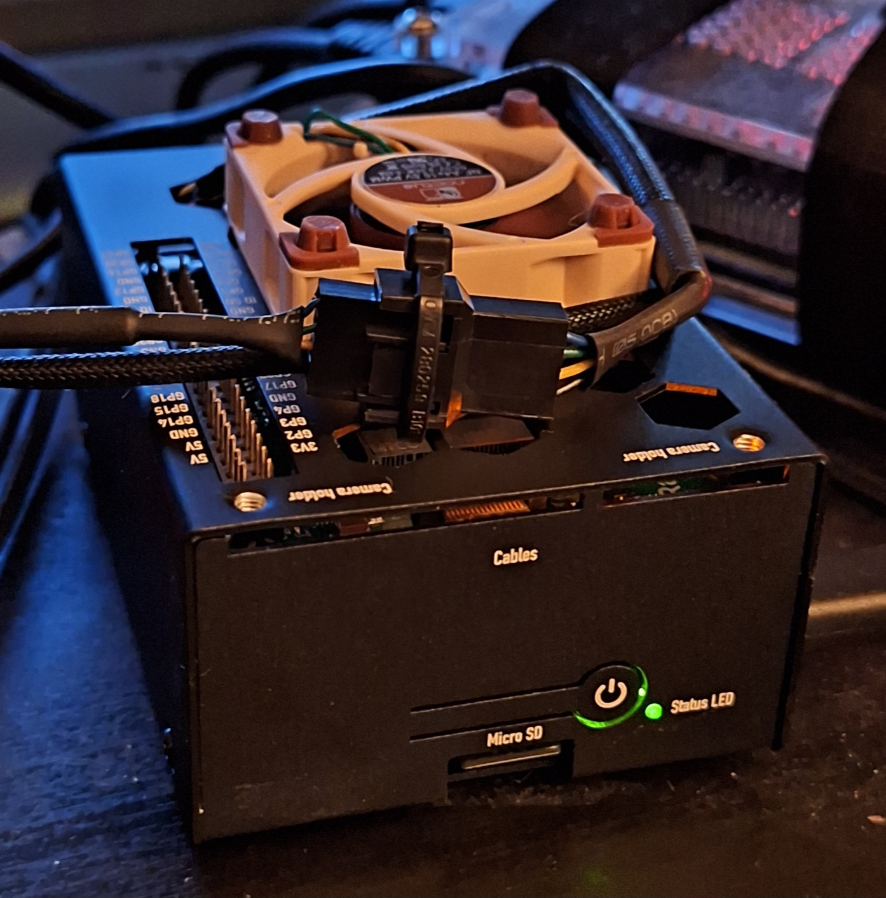
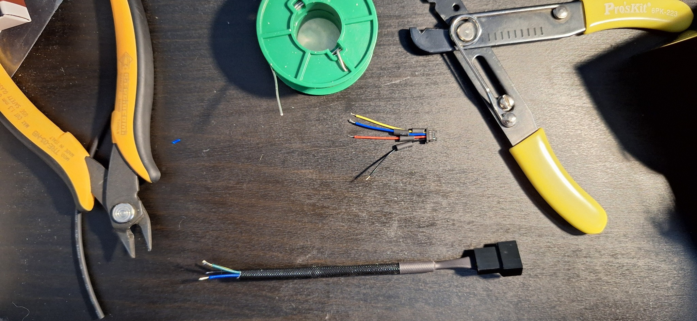
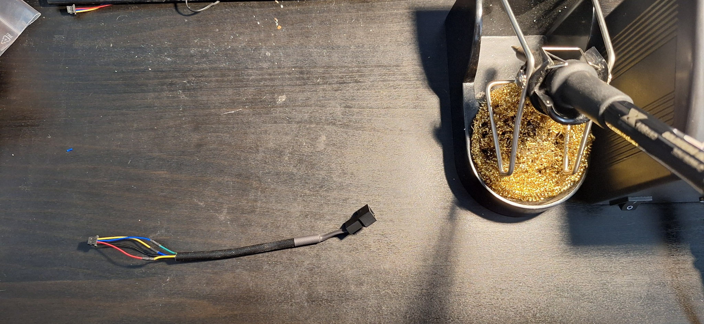
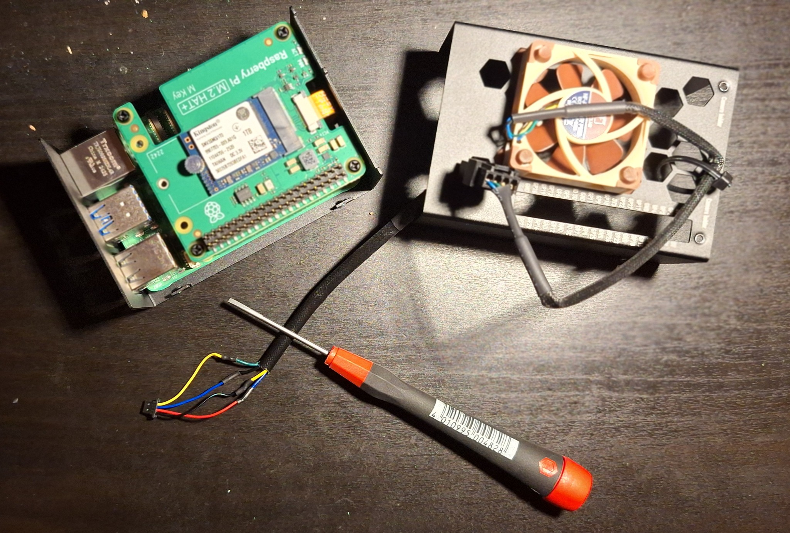

# Raspberry Pi 5 Noctua PWM Fan Mod

A documented Raspberry Pi 5 cooling mod using a **Noctua NF-A4x10 5V PWM** fan, a custom **JST-SH 4-pin to Noctua PWM adapter cable**, and a **KKSB Raspberry Pi 5 + M.2 NVMe HAT case**.

This project solves a practical problem: the Raspberry Pi 5 has a small onboard fan connector, while the Noctua 5V PWM fan uses a larger PWM fan connector. A custom adapter makes it possible to use the Noctua fan with the Raspberry Pi 5 fan header while keeping PWM control and RPM monitoring.



## Why this exists

The Raspberry Pi 5 official fan connector is useful, but the connector type is not directly compatible with the Noctua fan cable. In this build, the fan is mounted on the ventilated top plate of the KKSB case as an exhaust fan. This moves air through the case and also cools the Raspberry Pi 5, the low-profile heatsink, and the M.2 NVMe HAT area.

This is especially useful when using the Raspberry Pi 5 as a small server with NVMe storage.

## Hardware used

- Raspberry Pi 5
- Raspberry Pi M.2 HAT+
- KKSB Case for Raspberry Pi 5 and M.2 NVMe HAT  
  https://kksb-cases.com/products/kksb-case-for-raspberry-pi-5-and-m2-nvme-hat
- Noctua NF-A4x10 5V PWM 40x10 mm fan  
  https://thepihut.com/products/noctua-nf-a4x10-5v-pwm-40x10mm-quiet-cooling-fan
- JST-SH 4-pin cable, STEMMA QT / Qwiic compatible, 100 mm  
  https://partco.fi/tuote/jst-sh-4-pin-kaapeli-stemma-qt-qwiic-yhteensopiva-100mm-14644
- Low-profile Raspberry Pi 5 heatsink
- Heat shrink tubing
- Soldering tools
- Optional: 40 mm metal fan guard

## Tested system

```text
Raspberry Pi 5
Ubuntu 24.04.4 LTS (Noble Numbat)
Linux ubuntuserver 6.8.0-1056-raspi #60-Ubuntu SMP PREEMPT_DYNAMIC Thu May 7 21:58:14 UTC 2026 aarch64
```

## Verified working output

Fan RPM was detected through the Raspberry Pi 5 fan header:

```bash
cat /sys/class/hwmon/hwmon*/fan1_input
```

Example output:

```text
1541
```

CPU temperature reading:

```bash
cat /sys/class/thermal/thermal_zone0/temp
```

Example output:

```text
50700
```

This means 50.7 °C.

## Wiring summary

The adapter was made by soldering a JST-SH 4-pin cable to a Noctua extension cable.

### Raspberry Pi 5 fan connector / original fan mapping

Data used for the original Raspberry Pi 5 fan wiring:

```text
Original fan:
Pin 1 = red wire
Pin 2 = blue wire
Pin 3 = black wire
Pin 4 = yellow wire

Pin 1 = 5V
Pin 2 = PWM
Pin 3 = GND
Pin 4 = Tach
```

### Cable mapping used in this build

```text
Original fan:
red    = pin 1
blue   = pin 2
black  = pin 3
yellow = pin 4

JST-SH adapter cable:
black  = pin 1
red    = pin 2
blue   = pin 3
yellow = pin 4

Noctua NF-A4x10 5V PWM:
yellow = pin 1 / +5V
blue   = pin 2 / PWM
black  = pin 3 / GND
green  = pin 4 / Tach / RPM
```

Final functional mapping:

| Function | Raspberry Pi 5 fan header | Noctua wire |
|---|---:|---|
| +5V | Pin 1 | Yellow |
| PWM | Pin 2 | Blue |
| GND | Pin 3 | Black |
| Tach / RPM | Pin 4 | Green |

> Do not trust wire colors blindly. Verify continuity and pin order before connecting the adapter to the Raspberry Pi.

## Build photos

Prepared cables:



Soldered adapter:



Correct wiring before final installation:



Finished build:


## Important warning: connector orientation

The Raspberry Pi 5 fan connector is small, and the JST-SH plug can be damaged if inserted incorrectly or with too much force.

During this build, two pins were accidentally bent when the connector was aligned incorrectly. They were carefully straightened and the fan header continued to work normally.


## Fan control test

For testing only, the fan threshold can be temporarily lowered in:

```bash
sudo vim /boot/firmware/config.txt
```

Temporary test settings:

```ini
dtparam=fan_temp0=40000
dtparam=fan_temp0_hyst=5000
```

After reboot, the fan should start at around 40 °C. Once PWM and RPM monitoring have been verified, these temporary test lines can be removed.

## Why not use the official Raspberry Pi Active Cooler?

The official Raspberry Pi 5 Active Cooler is a good cooler, but this case uses an M.2 NVMe HAT above the Raspberry Pi. In this layout, clearance and airflow under the HAT are limited.

A top-mounted 40 mm exhaust fan is better suited for this enclosure because it moves air through the whole case instead of only cooling the CPU area. The NVMe area also benefits from the same airflow.

## Lessons learned

- The Raspberry Pi 5 fan connector uses a very small JST-SH style connector.
- Noctua 5V PWM fans are electrically suitable, but not mechanically plug-and-play with the Pi 5 fan header.
- Use the Noctua extension cable for the modification instead of cutting the fan's original cable.
- Always verify pinout with a multimeter before powering the board.
- Lowering the fan threshold temporarily is useful for testing PWM and tach/RPM feedback.
- Connector orientation matters. The fan header pins are easy to bend.

## License

MIT License. See [LICENSE](LICENSE).
