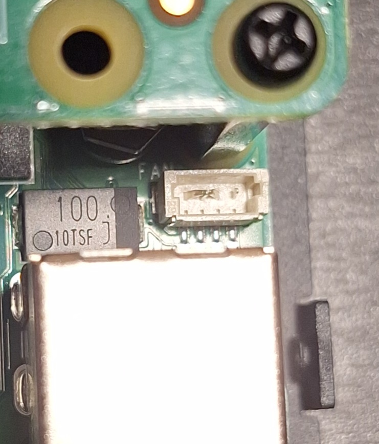

# Lessons learned

## Do not trust wire colors blindly

The JST-SH cable used here was marketed as STEMMA QT / Qwiic compatible. The connector fit the Raspberry Pi 5 fan header, but the colors were not directly meaningful for fan use. Always verify pin order.

## Use an extension cable

The Noctua extension cable was modified instead of the fan's own cable. This keeps the fan itself intact and replaceable.

## Connector orientation matters

The Raspberry Pi 5 fan header is small. Inserting the connector with the wrong orientation can bend the pins.



## PWM and tach worked

After lowering the fan threshold temporarily, the Raspberry Pi reported RPM correctly:

```text
1541
```
