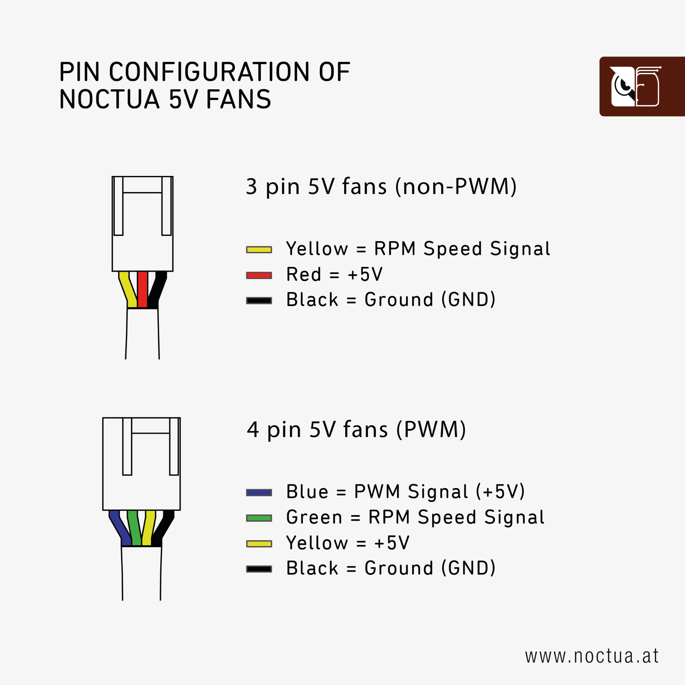

# Pinout notes

## Raspberry Pi 5 fan connector

Official documentation:

https://www.raspberrypi.com/documentation/computers/raspberry-pi.html#raspberry-pi-5-fan-connector-pinout

## Noctua 5V PWM fan pinout

Noctua NF-A4x10 5V PWM wire colors used in this build:

| Wire | Function |
|---|---|
| Yellow | +5V |
| Blue | PWM |
| Black | GND |
| Green | Tach / RPM |

